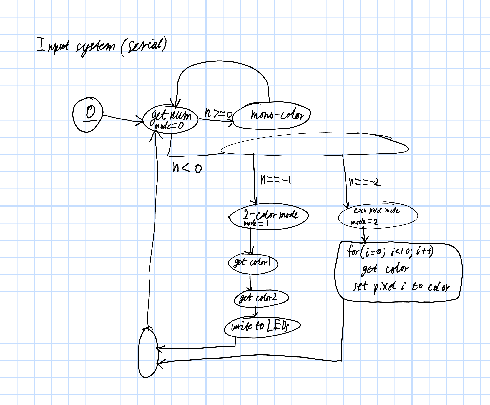

#Introduction
You know Philips Ambilight? This is my attempt at that.
Read about Ambilight [here](https://en.wikipedia.org/wiki/Ambilight).

#Platforms
The Python half of this project should work on Linux/Mac/Windows.
The most probable point of failure would be as platform's inability to tak screenshots.

#Materials
WS28* RGB LED strip attached to some sort of Arduino that has a serial connection to your PC.
The strip should of course have sufficient power to operate at full white.
The data line should be connected to pin 6 of your Arduino, although feel free to change the Arduino source to accomodate your hardware configuration.

#Requirements
Python libraries:
```
pyserial
pillow
```

#Installation.
Upload the arduino program found in `pc_rgb_controller` to your arduino.
Make sure to install the dependencies. Please.

#Usage
Run the appropriate launch script for your OS: `run.sh` for *nix and `run.bat` for Windows.
If you have multiple serial devices connected the command line interface asks you to choose one.
Make sure to choose the serial port connected to your Arduino.
Enjoy!

#Under the hood

##PC
The Python `pillow` library is used to grab a screenshot of the desktop. That screenshot is then sliced it into vertical strips, the strips are resizedinto 1x1 thumbnails.
That RGB values of those thumbnails are packed/serialized into integers which are sent to the Arduino via `pyserial`.

##Arduino
The `loop()` checks for a integer sent over serial connection, unpacks/deserializes the RGB values from it and writes that color to the whole strip.
There are also ways to write colors to individual pixel.

Integers sent over serial should be separated by newlines.

A state machine diagram of the input system:


An example command to the 'duino might look like this: `16777215`. A single positive integer sent over serial will be interpreted as a "packed" RGB value. That particular value is (255,255,255), or white.

Another command, `-1\n16711680\n65280` does a couple of things. The first number, -1 puts the 'duino in 2-color mode, after which it looks for two more numbers, which are the following numbers.

#Future
Eventually I will add some sort of command structure so that more complex animations can be triggered and controlled by the PC.